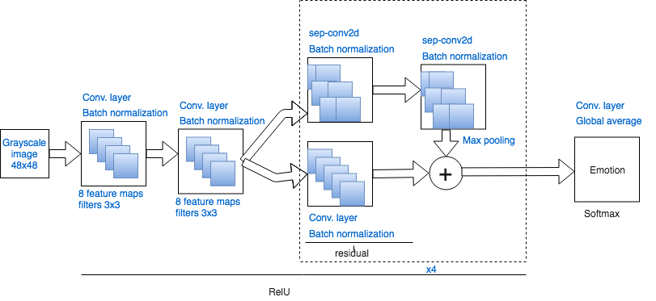
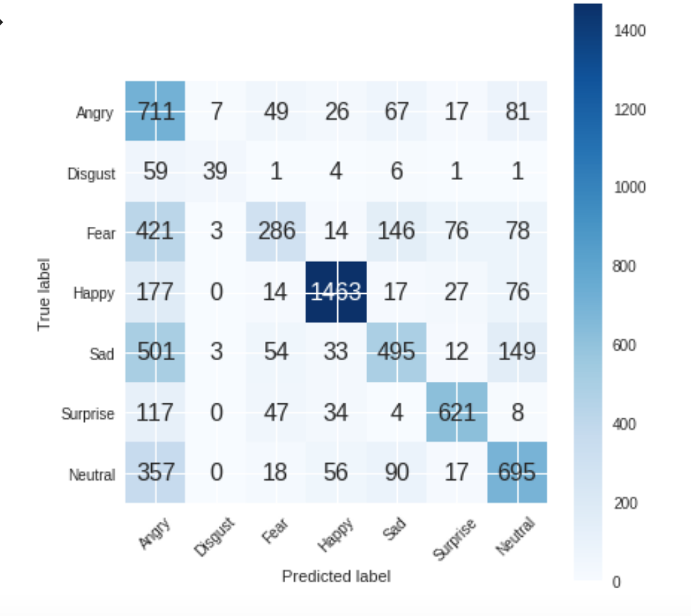

# Facial emotion recognition using Deep Learning techniques and Google Colab

This project is part of the investigation line of Sentiment Analysis of [GSI department](http://www.gsi.upm.es/es/) of [ETSIT-UPM](http://www.etsit.upm.es/). The main goal is to design an algorithm capable of recognizing emotions from facial expressions. To do so, a Convolutional Neural Network (CNN from now on) implemented with  Keras (a Python API to develop Neural Networks easily) and trained in Google Colab platform, will be used. The reason of using outer resources is to decrease training time 100 times.

The dataset used for training the model is from a Kaggle Facial Expression Recognition Challenge a few years back (FER2013). It compromises a total of 35887, 48-by-48- pixel grayscale images of faces each labeled with one of the emotions. Therefore the final result is: anger, disgust, fear, happiness, sadness, surprise, and neutral. In Figure 1, a distribution of the number of images per emotion is shown, so that it can be seen that the most popular emotion is happiness.

Furthermore, a data preprocessing is carried out so that the set of images is split into Training set and Test set. The script used can be found [datapreProcessing.py](datapreProcessing.py). 

## CNN Architecture overview

As it can be seen is a fully-convolutional neural network consisting of 2 convolutional layers of 8 features. ReLu activation, 3x3 with a kernel regularizer, followed by a batch normalization. Then there are four modules in which a residual is implemented (convolutional layer, 1x1, followed by a batch normalization) and added to the separable convolutional layer, 3x3 with kernel regularization, followed by a batch normalization as well. The size of these convolutional kernels is increasing in each module, starting in 16 and ending in 128. Finally the classification itself is carried out through a convolutional layer with the size equal to the number of emotions to be predicted, followed by a Global average pooling layer with Softmax activation.

## Training phase

The Jupyter Notebook used in Google Colab, can be found [CNN_implementation.ipynb](CNN_implementation.ipynb)

Some techniques to avoid overfitting are applied, such as early-stopping and data-augmentation. For a better understanding visit this [article]().

## Conclusions

We obtained an accuracy of *70.87 %*  in Train set and a Test accuracy of *63.026 %*. Furthermore, the confusion matrix is represented. Confusion matrix is also known as error matrix in statistical field, due to the fact that it represents the performance of an algorithm.

