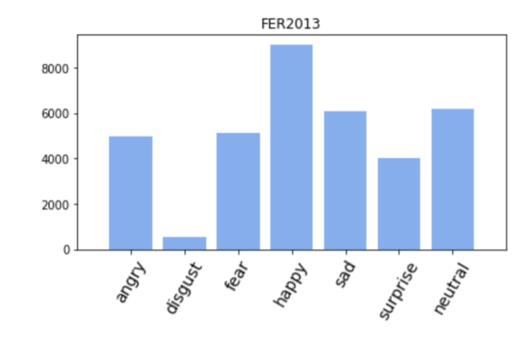

# emo-prediction

This project is part of the investigation line of Sentiment Analysis of GSI department of ETSIT-UPM. The main goal is to design an algorithm capable of recognizing emotions from facial expressions. To do so, a Convolutional Neural Network (CNN from now on) implemented with  Keras (a Python API to develop Neural Networks easily) and trained in Google Colab platform, will be used. The reason of using outer resources is to decrease training time 100 times.

The dataset used for training the model is from a Kaggle Facial Expression Recognition Challenge a few years back (FER2013). It compromises a total of 35887, 48-by-48- pixel grayscale images of faces each labeled with one of the emotions. Therefore the final result is: anger, disgust, fear, happiness, sadness, surprise, and neutral. In Figure 1, a distribution of the number of images per emotion is shown, so that it can be seen that the most popular emotion is happiness.

Furthermore, a data preprocessing is carried out so that the set of images is split into Training set and Test set. The script used can be found [datapreProcessing.py](datapreProcessing.py). 
